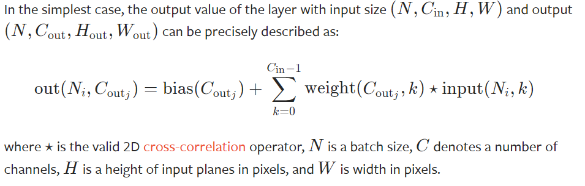

# 添加卷积操作学习细节记录
# 2022.04.29
学了两天的卷积操作，尝试逐个实现。由于之前代码有许多不兼容或没考虑到的问题，
还需要先优化源代码。(比如更新参数部分，之前由于只有线性层故直接写在父类Model中，
如今需要将其移走。考虑是否先定一个优化器占位)

## Conv2D

——from pytorch.org

先用最简单的for循环实现基本功能在考虑优化的事。

### Reference

- [卷积计算含Bias](https://zhuanlan.zhihu.com/p/268179286?ivk_sa=1024320u)
- [卷积层的反向传播](https://blog.csdn.net/weixin_37721058/article/details/102327691)
- [Python实现卷积神经网络](https://blog.csdn.net/weixin_37251044/article/details/81349287)
- [Conv1D和Conv2D的区别](https://zhuanlan.zhihu.com/p/156825903)
- [卷积操作的初始化方法](https://blog.csdn.net/weixin_44503976)