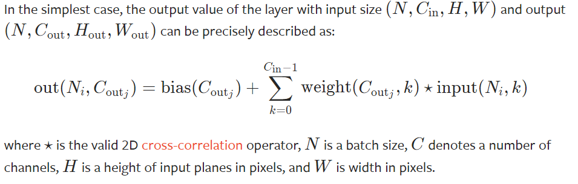
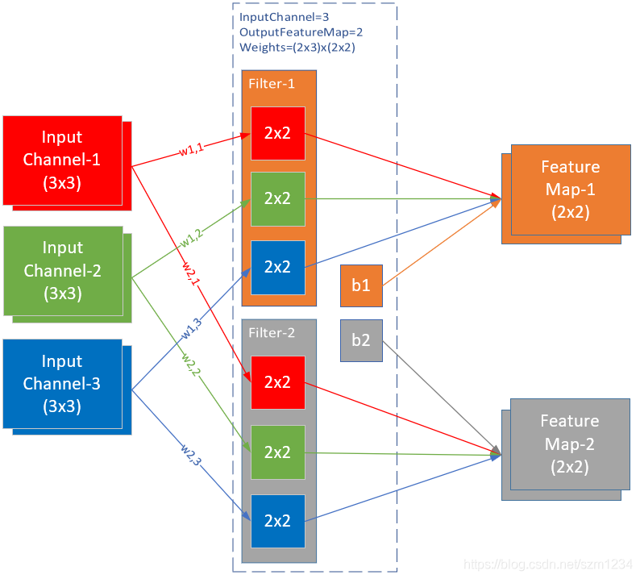

# 添加卷积操作学习细节记录

##  2022.05.03
优化卷积运算，as_strided和tensordot加速计算(参见[11])。
- 多层卷积acc一直上不去怀疑反向传播有问题，但与torch对照，梯度完全一样。很奇怪。

## 2022.05.01
添加stride操作，微难。涉及的地方太多了，有很多要改的。又看了一下如何加速运算，
似乎不同方法对于stride的处理不能通用，难顶。
- 目前stride计算已经加入工程，但还存在Bug，默认为1时可以正常允许。写不动了明天继续
    今天写把卷积的好搭档MaxPooling加进来。
- 基础MaxPooling已加入。

## 2022.04.29
学了两天的卷积操作，尝试逐个实现。由于之前代码有许多不兼容或没考虑到的问题，
还需要先优化源代码。(比如更新参数部分，之前由于只有线性层故直接写在父类Model中，
如今需要将其移走。考虑是否先定一个优化器占位)

### Conv2D

——from pytorch.org

——from pytorch.org

先用最简单的for循环实现基本功能在考虑优化的事。

## Reference

- [11]  [卷积算法高效实现-as_strided详解](https://zhuanlan.zhihu.com/p/64933417)
- [10] [CNN反向传播](https://jermmy.github.io/2017/12/16/2017-12-16-cnn-back-propagation/)
- [9] [CNN反向传播含Pooling](https://www.cnblogs.com/pinard/p/6494810.html)
- [8] [CNN 卷积层反向传播](https://zhuanlan.zhihu.com/p/40951745)
- [7] [CNN反向传播算法](https://zhuanlan.zhihu.com/p/81675803)
- [6] [stride>2的反向传播](https://blog.csdn.net/qq_34341423/article/details/102923488)
- [5] [卷积计算含Bias](https://zhuanlan.zhihu.com/p/268179286?ivk_sa=1024320u)
- [4] [卷积层的反向传播](https://blog.csdn.net/weixin_37721058/article/details/102327691)
- [3] [Python实现卷积神经网络](https://blog.csdn.net/weixin_37251044/article/details/81349287)
- [2] [Conv1D和Conv2D的区别](https://zhuanlan.zhihu.com/p/156825903)
- [1] [卷积操作的初始化方法](https://blog.csdn.net/weixin_44503976)
